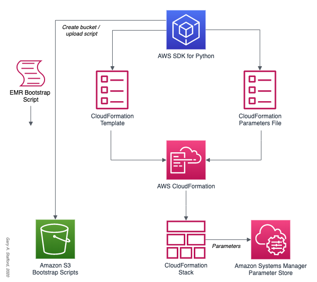

# PySpark on Amazon EMR Demo

## Overview

Project files for the post, [Running PySpark Applications on Amazon EMR: Methods for Interacting with PySpark on Amazon Elastic MapReduce](https://garystafford.medium.com/running-pyspark-applications-on-amazon-emr-e536b7a865ca). Please see post for complete instructions on using the project's files.

## Architecture

### AWS CloudFormation Stack Creation

  
  
### Data Analytics Platform

